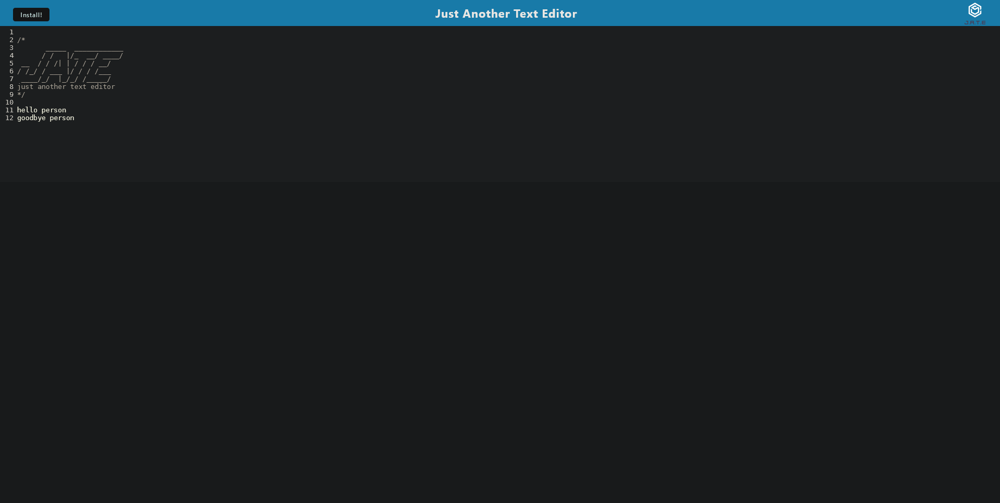

# JATE text editor

\
[Try it out!](https://mkalik-jate-editor.herokuapp.com/)

## Table of Contents:
[description](#desc)

[Installation](#1)

[Usage](#2)

[Credits](#3)

[License](#4)

[Contributing](#5)

[Tests](#6)

[Questions](#7)

# 
## 0.Description:
An in browser text editor that can be installed and run offline
# 
## 1.Installation:
this app is prebuilt so there are no requirements ( however if you are on firefox, in order to download the app you must use the provided extension: [PWAs for Firefox](https://addons.mozilla.org/en-US/firefox/addon/pwas-for-firefox/) )
# 
## 2.Usage:
simply click anywhere and begin typing! the app will save all of the text input as soon as th browser loses focus
# 
## 3.Credits:
mkalik

this application was built from starter code which can be found [here](https://github.com/coding-boot-camp/cautious-meme)
# 
## 4.License:
https://opensource.org/licenses/MIT
# 
## 5.How to contribute:
none
# 
## 6.Tests:
none
# 
## 7.Questions:
Please contact me here [github](https://github.com/mkalik)
